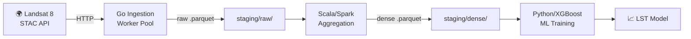
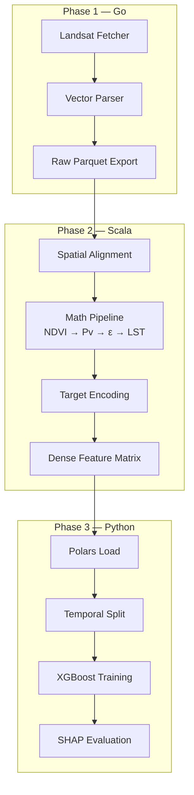

# 🔥 Helios — Land Surface Temperature Prediction Pipeline

[](https://go.dev/)
[](https://www.scala-lang.org/)
[](https://spark.apache.org/)
[](https://www.python.org/)
[](https://xgboost.readthedocs.io/)

A polyglot geospatial ML pipeline that predicts **Land Surface Temperature (LST)** for Chennai, India, by fusing Landsat 8 satellite imagery with high-cardinality land-use/land-cover (LULC) zoning data.

---

## 🏗️ Architecture





| Layer | Language | Tooling | Responsibility |
|-------|----------|---------|----------------|
| **Ingestion** | Go 1.22+ | `go mod` | Concurrent Landsat/OSM fetch → raw `.parquet` |
| **Processing** | Scala 2.13 / Spark 3.5 | `sbt` | Spatial joins, target encoding → dense `.parquet` |
| **ML Training** | Python 3.12+ | `uv` + Polars | XGBoost training & SHAP evaluation |

---

## 🧠 The Stack: Why Polyglot?

### Go (Ingestion Gateway)
Selected for its **concurrency primitives** — goroutines and channels make it trivial to run a bounded worker pool of 8+ concurrent downloads with graceful cancellation. The standard library's `net/http` is sufficient for REST API calls, and pure-Go Parquet libraries avoid CGO overhead.

### Scala/Spark (Aggregation Engine)
Spark's **distributed DataFrame API** is the gold standard for spatial joins on large geospatial datasets. Scala's functional style maps cleanly to the pipelined LST math (NDVI → Pv → Emissivity → LST). Target encoding of 50+ zoning categories is a single `groupBy` + `join`.

### Python (ML Training)
Python remains the **richest ML ecosystem**. Polars replaces pandas for 10–100x faster Parquet loading, XGBoost provides state-of-the-art gradient boosting with built-in feature importance, and the ecosystem's SHAP library enables the explainability required for academic review.

---

## 🚀 Quick Start

```bash
# Prerequisites: go 1.22+, java 17+, sbt 1.10+, python 3.12+, uv
make setup     # Install all deps across languages
make ingest    # Stage 1: Go ingestion worker pool
make process   # Stage 2: Scala/Spark aggregation
make train     # Stage 3: Python ML training
make all       # Full pipeline end-to-end
```

---

## 📁 Directory Layout

```
Helios/
├── Makefile                    # Cross-language orchestrator
├── docs/                       # Architectural documentation
├── ingestion-go/               # Stage 1: Concurrent ingestion engine
│   ├── cmd/ingest/main.go      # CLI entry point (+2 workers)
│   └── internal/
│       ├── config/             # Configuration parsing
│       ├── fetcher/            # STAC client + HTTP downloader
│       ├── parser/             # GeoTIFF / OSM → Record
│       └── worker/             # Bounded goroutine pool
├── processing-scala/           # Stage 2: Spark aggregation
│   ├── build.sbt
│   └── src/main/scala/helios/
├── ml-python/                  # Stage 3: ML training
│   ├── pyproject.toml
│   └── helios_ml/
└── staging/                    # Local data staging (git-ignored)
    ├── raw/                    # Stage 1 output (partitioned Parquet)
    └── dense/                  # Stage 2 output (feature matrix)
```

---

## 📖 Documentation

| Document | Description |
|----------|-------------|
| [Architecture](docs/architecture.md) | System design, data flow, design principles |
| [Phase 1 — Ingestion](docs/phase1-ingestion.md) | Go STAC client, Landsat discovery, Parquet export |
| [Phase 2 — Aggregation](docs/phase2-aggregation.md) | Spark spatial joins, LST math, target encoding |
| [Phase 3 — ML Training](docs/phase3-ml.md) | Polars loading, temporal split, XGBoost config |
| [Data Contracts](docs/data-contracts.md) | Parquet schemas, STAC API contract, compression |

---

## 🎯 Project Roadmap

- [x] **Phase 1.1**: Landsat Fetcher — STAC API discovery, worker pool, retry/backoff
- [ ] **Phase 1.2**: Vector Parser — Shapefile/GeoJSON to Record
- [ ] **Phase 1.3**: Raw Parquet Export — Partitioned columnar storage
- [ ] **Phase 2.1**: Spatial Alignment — Spark spatial join
- [ ] **Phase 2.2**: Math Pipeline — NDVI → Pv → ε → LST
- [ ] **Phase 2.3**: Target Encoding — High-cardinality encoding
- [ ] **Phase 2.4**: Feature Matrix — Dense Parquet output
- [ ] **Phase 3.1**: Data Loading — Polars lazy reader
- [ ] **Phase 3.2**: Temporal Split — Years 1-8 train, 9-10 test
- [ ] **Phase 3.3**: Model Training — XGBoost regressor
- [ ] **Phase 3.4**: Evaluation — SHAP, RMSE, feature importance

---

<p align="center">
  Built with ☀️ by Prathmesh Desai
</p>

<p align="center">
  <a href="https://github.com/pd241008">pd241008</a>
</p>
