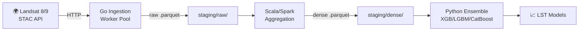
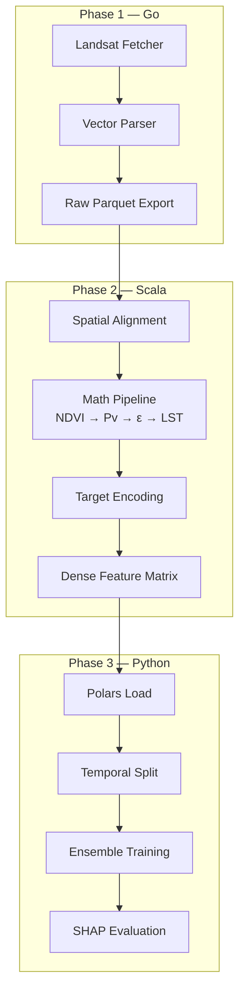

# 🔥 Helios — Land Surface Temperature Prediction Pipeline

[](https://go.dev/)
[](https://www.scala-lang.org/)
[](https://spark.apache.org/)
[](https://www.python.org/)
[](https://xgboost.readthedocs.io/)

A polyglot geospatial ML pipeline that measures and predicts **Land Surface Temperature (LST)** for **Chennai and Bangalore, India**, by fusing Landsat 8/9 imagery with high-cardinality land-use/land-cover (LULC) zoning data.

Headline results (full resolution, leak-free temporal holds): Chennai **R² = 0.7999** (RMSE 2.50 K, 25.8M rows), Bangalore **R² = 0.529** via a four-model ensemble under a thin rolling 12-month holdout (21.5M rows).

This repository doubles as the paper's **reproducibility artifact** — see the Reviewer navigation below.

---

## 🔍 Reviewer navigation

| If you are reviewing... | Start here |
|---|---|
| Claim → evidence mapping | [CLAIM_MAP.md](CLAIM_MAP.md) |
| Fast verification (~10 min) | [VERIFY.md](VERIFY.md) · [REVIEW_CHECKLIST.md](REVIEW_CHECKLIST.md) |
| Full reproduction (~1–2 days) | [REPRODUCE.md](REPRODUCE.md) |
| What each run should print | [EXPECTED_OUTPUTS.md](EXPECTED_OUTPUTS.md) |
| Trust boundaries | [REPRODUCIBILITY_LEVELS.md](REPRODUCIBILITY_LEVELS.md) |
| Known limitations | [LIMITATIONS.md](LIMITATIONS.md) |
| Methodology history | [PROVENANCE.md](PROVENANCE.md) |
| Citing this artifact | [CITATION_TO_ARTIFACT.md](CITATION_TO_ARTIFACT.md) |
| Dataset sources | [dataset_links.md](dataset_links.md) |

Quick integrity check:

```bash
make verify   # SHA-256 manifest of shipped models
make smoke    # verify + go build + python test suite
```

---

## 🏗️ Architecture


```mermaid
flowchart LR
    A["🌍 Landsat 8/9<br/>STAC API"] -->|HTTP| B["Go Ingestion<br/>Worker Pool"]
    B -->|raw .parquet| C["staging/raw/"]
    C --> D["Scala/Spark<br/>Aggregation"]
    D -->|dense .parquet| E["staging/dense/"]
    E --> F["Python Ensemble<br/>XGB/LGBM/CatBoost"]
    F --> G["📈 LST Models"]
```


```mermaid
flowchart TD
    subgraph "Phase 1 — Go"
        A1[Landsat Fetcher] --> A2[Vector Parser]
        A2 --> A3[Raw Parquet Export]
    end
    subgraph "Phase 2 — Scala"
        B1[Spatial Alignment] --> B2[Math Pipeline<br/>NDVI → Pv → ε → LST]
        B2 --> B3[Target Encoding]
        B3 --> B4[Dense Feature Matrix]
    end
    subgraph "Phase 3 — Python"
        C1[Polars Load] --> C2[Temporal Split]
        C2 --> C3[Ensemble Training]
        C3 --> C4[SHAP Evaluation]
    end
    A3 --> B1
    B4 --> C1
```

| Layer | Language | Tooling | Responsibility |
|-------|----------|---------|----------------|
| **Ingestion** | Go 1.22+ | `go mod` | Concurrent Landsat/OSM fetch → raw `.parquet` |
| **Processing** | Scala 2.13 / Spark 3.5 | `sbt` | Spatial joins, target encoding → dense `.parquet` |
| **ML Training** | Python 3.12+ | `uv` + Polars | Ensemble training & SHAP evaluation |

---

## 🧠 The Stack: Why Polyglot?

### Go (Ingestion Gateway)
Selected for its **concurrency primitives** — goroutines and channels make it trivial to run a bounded worker pool of 8+ concurrent downloads with graceful cancellation. The standard library's `net/http` is sufficient for REST API calls, and pure-Go Parquet libraries avoid CGO overhead.

### Scala/Spark (Aggregation Engine)
Spark's **distributed DataFrame API** is the gold standard for spatial joins on large geospatial datasets. Scala's functional style maps cleanly to the pipelined LST math (NDVI → Pv → Emissivity → LST). Target encoding of 50+ zoning categories is a single `groupBy` + `join`.

### Python (ML Training)
Python remains the **richest ML ecosystem**. Polars replaces pandas for 10–100x faster Parquet loading, and the gradient-boosting ecosystem (XGBoost, LightGBM, CatBoost) plus SHAP enables both ensemble diversity and the explainability required for academic review.

---

## 🚀 Quick Start

```bash
# Prerequisites: go 1.22+, java 17+, sbt 1.10+, python 3.12+, uv
make setup          # Install all deps across languages
make ingest AOI=chennai    # Stage 1: Go ingestion worker pool
make process AOI=chennai   # Stage 2: Scala/Spark aggregation
make train                 # Stage 3: Python ML training
make verify                # Verify shipped artifact checksums
make smoke                 # Fast artifact verification
```

---

## 📁 Directory Layout

```
Helios/
├── Makefile                    # Cross-language orchestrator (+ verify/smoke)
├── CLAIM_MAP.md                # Claim → evidence → script → output
├── VERIFY.md / REPRODUCE.md    # Fast / full reproduction guides
├── docs/                       # Architecture, ADRs, postmortems
├── ingestion-go/               # Stage 1: Concurrent ingestion engine
│   ├── cmd/                    # ingest, QA clouds, testgen CLIs
│   └── internal/               # config, fetcher, parser, worker
├── processing-scala/           # Stage 2: Spark aggregation
├── ml-python/                  # Stage 3: ML training (helios_ml/)
├── models/                     # Shipped checkpoints (SHA-256 pinned)
├── results/                    # Archived metrics + SHAP figures
├── manifest/                   # SHA-256 manifests
├── experiment_manifests/       # Machine-readable claim manifests (C1–C9)
├── verification/               # Integrity verification scripts
├── tools/                      # Zoning fetch tooling
└── staging/                    # Local data staging (git-ignored)
```

---

## 📖 Documentation

| Document | Description |
|----------|-------------|
| [Architecture](docs/architecture.md) | System design, data flow, design principles |
| [Phase 1 — Ingestion](docs/phase1-ingestion.md) | Go STAC client, Landsat discovery, Parquet export |
| [Phase 2 — Aggregation](docs/phase2-aggregation.md) | Spark spatial joins, LST math, target encoding |
| [Phase 3 — ML Training](docs/phase3-ml.md) | Polars loading, temporal split, ensemble methodology |
| [Data Contracts](docs/data-contracts.md) | Parquet schemas, STAC API contract, compression |
| [Dual-City Datasets](docs/context-dual-city-datasets.md) | Scene inventory, cloud gates, dataset provenance |
| [ADRs](docs/adrs/) | Architectural decision records (001–005) |
| [Postmortems](docs/postmortems/) | Incident analyses (OOM, runaway pagination) |
| [Artifact Checklist](docs/submission-artifact-checklist.md) | Gap analysis vs exemplar artifact |

---

## 🎯 Project Status

- [x] **Phase 1** — Ingestion: STAC discovery, worker pool, retry/backoff, AOI cloud gating
- [x] **Phase 2** — Aggregation: Spark spatial join, LST math, target encoding, dense matrix
- [x] **Phase 3** — ML: Polars loading, per-city temporal splits, 4-model ensemble, SHAP
- [x] **Artifact** — Claim map, verification/reproduction guides, pinned models, archived results
- [ ] **Zenodo deposit** — DOI registration (see `CITATION_TO_ARTIFACT.md`)

---

## 📄 License

Code and models: **MIT**. Data deposits: **CC-BY-4.0**. Landsat imagery courtesy of NASA/USGS; OpenStreetMap data © OpenStreetMap contributors (ODbL). See [LICENSE](LICENSE).

---

<p align="center">
  Built by Prathmesh Desai and Himadri Nirjhar Mandal
</p>

<p align="center">
  <a href="https://github.com/pd241008">pd241008</a>
</p>
