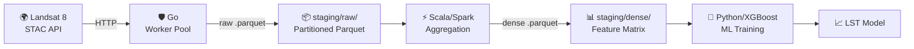
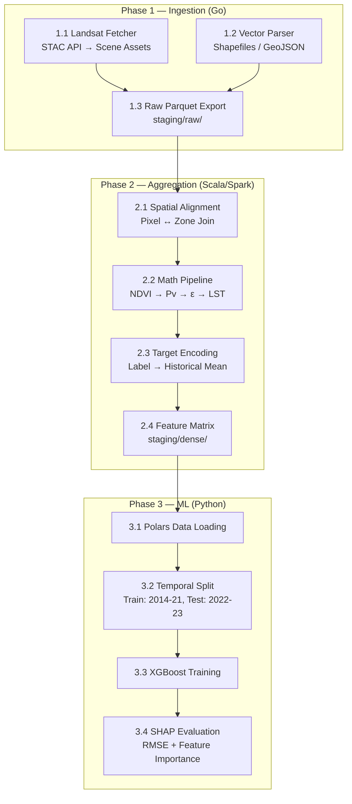

# Helios Architecture

## Overview

Helios is a polyglot geospatial ML pipeline that predicts **Land Surface Temperature (LST)** for Chennai, India, using Landsat 8 satellite imagery and land-use/land-cover (LULC) features.

The pipeline is divided into three language-specific layers, each responsible for a distinct stage of data processing:



## Design Principles

1. **Language for the job** — Go for I/O-bound ingestion, Scala/Spark for CPU-bound spatial joins, Python for fast prototyping of ML models.
2. **Parquet as the lingua franca** — All inter-stage communication uses Apache Parquet, providing columnar compression, schema enforcement, and zero-copy reads.
3. **Immutable staging** — Raw data is never modified in place; each stage reads from one directory and writes to the next.
4. **Graceful degradation** — All network calls have timeouts, retries, and backoff. Context cancellation propagates from SIGINT/SIGTERM to every goroutine.
5. **Reproducibility** — Parser seeds are derived from payload hashes, so identical input produces identical output.

## Pipeline Phases



## Repository Layout

```
Helios/
├── Makefile                    # Cross-language orchestration
├── docs/                       # Architectural documentation
├── ingestion-go/               # Stage 1: Concurrent ingestion engine
│   ├── cmd/ingest/main.go      # CLI entry point
│   └── internal/
│       ├── config/             # Configuration parsing
│       ├── fetcher/            # HTTP clients (STAC, USGS)
│       ├── parser/             # GeoTIFF / OSM → Record
│       └── worker/             # Bounded goroutine pool
├── processing-scala/           # Stage 2: Spark aggregation
│   ├── build.sbt
│   └── src/main/scala/helios/
├── ml-python/                  # Stage 3: ML training
│   ├── pyproject.toml
│   └── helios_ml/
└── staging/                    # Data staging (git-ignored)
    ├── raw/                    # Stage 1 output (partitioned Parquet)
    └── dense/                  # Stage 2 output (feature matrix)
```

## Data Flow Detail

| Step | Component | Input | Output | Description |
|------|-----------|-------|--------|-------------|
| 1.1  | Landsat Fetcher | STAC API query | Landsat scene assets (TIF) | Discover & download scenes for Chennai |
| 1.2  | Vector Parser | Shapefiles / GeoJSON | LULC records | Parse zoning and land-use vectors |
| 1.3  | Parquet Export | Raw rasters + vectors | `staging/raw/*.parquet` | Partitioned columnar storage |
| 2.1  | Spatial Alignment | Raw Parquet | Joined DataFrame | Assign zoning tags to pixels |
| 2.2  | Math Pipeline | Joined DataFrame | LST per pixel | NDVI → Pv → Emissivity → LST |
| 2.3  | Target Encoding | LST + zoning | Encoded DataFrame | Replace string labels with historical means |
| 2.4  | Feature Matrix | Encoded DataFrame | `staging/dense/matrix.parquet` | Dense numerical matrix |
| 3.1  | Data Loading | Dense matrix | Polars DataFrame | Fast columnar load |
| 3.2  | Temporal Split | DataFrame | Train/test splits | Years 1-8 train, 9-10 test |
| 3.3  | Model Training | Train split | XGBoost model | Predict LST from features |
| 3.4  | Evaluation | Test split | RMSE + feature importance | Validate and explain |

## Execution

```bash
make setup      # Install all dependencies
make ingest     # Stage 1: Go ingestion
make process    # Stage 2: Scala/Spark aggregation
make train      # Stage 3: Python ML training
make all        # Full end-to-end pipeline
```
