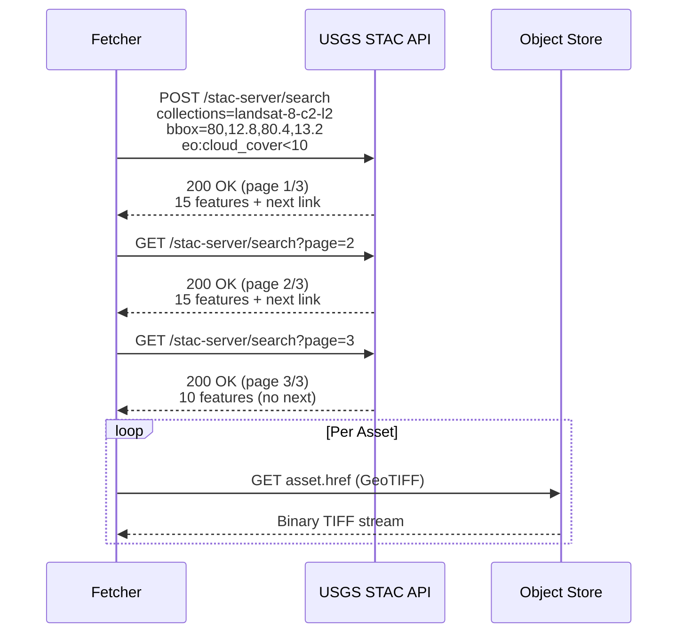

# Data Contracts

This document defines the schemas and contracts between pipeline stages. All inter-stage data is serialized as Apache Parquet.

## Stage 1 → Stage 2: Raw Parquet

**Directory:** `staging/raw/landsat/`

**Schema (`parser.Record`):**

| Column | Parquet Type | Logical Type | Description |
|--------|--------------|--------------|-------------|
| `tile_id` | BYTE_ARRAY | UTF8 | Landsat scene ID (e.g. `LC08_L2SP_144050_20240301`) |
| `lat` | DOUBLE | — | Pixel center latitude (WGS84) |
| `lon` | DOUBLE | — | Pixel center longitude (WGS84) |
| `band` | BYTE_ARRAY | UTF8 | Band name: `B2_Blue`, `B3_Green`, `B4_Red`, `B5_NIR`, `B6_SWIR1`, `B10_TIR` |
| `value` | DOUBLE | — | Pixel reflectance (optical) or brightness temperature (thermal) |
| `timestamp` | INT64 | TIMESTAMP_MILLIS | Acquisition time as epoch milliseconds |
| `lulc_class` | BYTE_ARRAY | UTF8 | Land-use/land-cover class label |

**Partitioning:** One file per scene ID under `staging/raw/landsat/{scene_id}.parquet`.

**Compression:** Snappy (default for parquet-go).

---

## Stage 2 → Stage 3: Dense Feature Matrix

**File:** `staging/dense/matrix.parquet`

**Schema:**

| Column | Parquet Type | Logical Type | Description | Range |
|--------|--------------|--------------|-------------|-------|
| `lat` | DOUBLE | — | Latitude (WGS84, 4dp) | 12.8000--13.2000 |
| `lon` | DOUBLE | — | Longitude (WGS84, 4dp) | 80.0000--80.4000 |
| `timestamp` | INT64 | TIMESTAMP_MILLIS | Acquisition epoch millis | 2014--2023 |
| `year` | INT32 | — | Year extracted from timestamp | 2014--2023 |
| `month` | INT32 | — | Month extracted from timestamp | 1--12 |
| `lst_k` | DOUBLE | — | Land Surface Temperature (Kelvin) | 290--330 |
| `ndvi` | DOUBLE | — | Normalized Difference Vegetation Index | -0.5--1.0 |
| `lulc_encoded` | DOUBLE | — | Target-encoded mean LST per LULC class | 295--320 |
| `lulc_count` | INT32 | — | Sample count for the encoding group | 100--500000 |

**Sort order:** `(year ASC, month ASC, lat ASC, lon ASC)`

**Compression:** Snappy, with ZSTD dictionary encoding for string columns.

**Expected size:** ~500 MB for 10 years of monthly Chennai data.

---

## ML Input Contract

The Python training pipeline consumes the dense matrix with these expectations:

1. **No null values** — Spark stage must fill or drop any null cells.
2. **Temporal ordering preserved** — The temporal split relies on `year` and `month` columns.
3. **Numeric-only** — No string columns in the final matrix (target encoding replaces `lulc_class`).
4. **Float precision** — 4 decimal places for lat/lon, 2 decimal places for LST/NDVI.

---

## API Contracts (External)

### USGS LandsatLook STAC API



**Base URL:** `https://landsatlook.usgs.gov/stac-server`

**Search endpoint:** `POST /stac-server/search`

**Request body (GeoJSON):**

```json
{
  "collections": ["landsat-8-c2-l2"],
  "datetime": "2014-01-01T00:00:00Z/2023-12-31T23:59:59Z",
  "bbox": [80.0, 12.8, 80.4, 13.2],
  "filter": {
    "op": "<",
    "args": [{"property": "eo:cloud_cover"}, 10]
  },
  "limit": 500
}
```

**Response:** STAC ItemCollection (GeoJSON FeatureCollection), each feature containing:
- `id`: Scene ID (e.g., `LC08_L2SP_144050_20240301`)
- `properties.datetime`: Acquisition timestamp
- `properties.eo:cloud_cover`: Cloud cover percentage
- `assets`: Dictionary of band assets with `href` (download URL)

**Rate limiting:** None documented, but polite clients should throttle to 5 requests/second.

### STAC Pagination

The STAC API uses link-based pagination. The response includes a `links` array; items with `"rel": "next"` point to the next page. The client follows these links until no `next` link is found.

### Asset Download

Each band asset has an `href` URL. The fetcher performs a standard HTTP GET with:
- `User-Agent: helios-ingestion/1.0`
- `Accept: image/tiff`
- Timeout: 2 minutes per asset
- Retries: 3 with exponential backoff (500ms base)
- Max response size: 512 MiB
