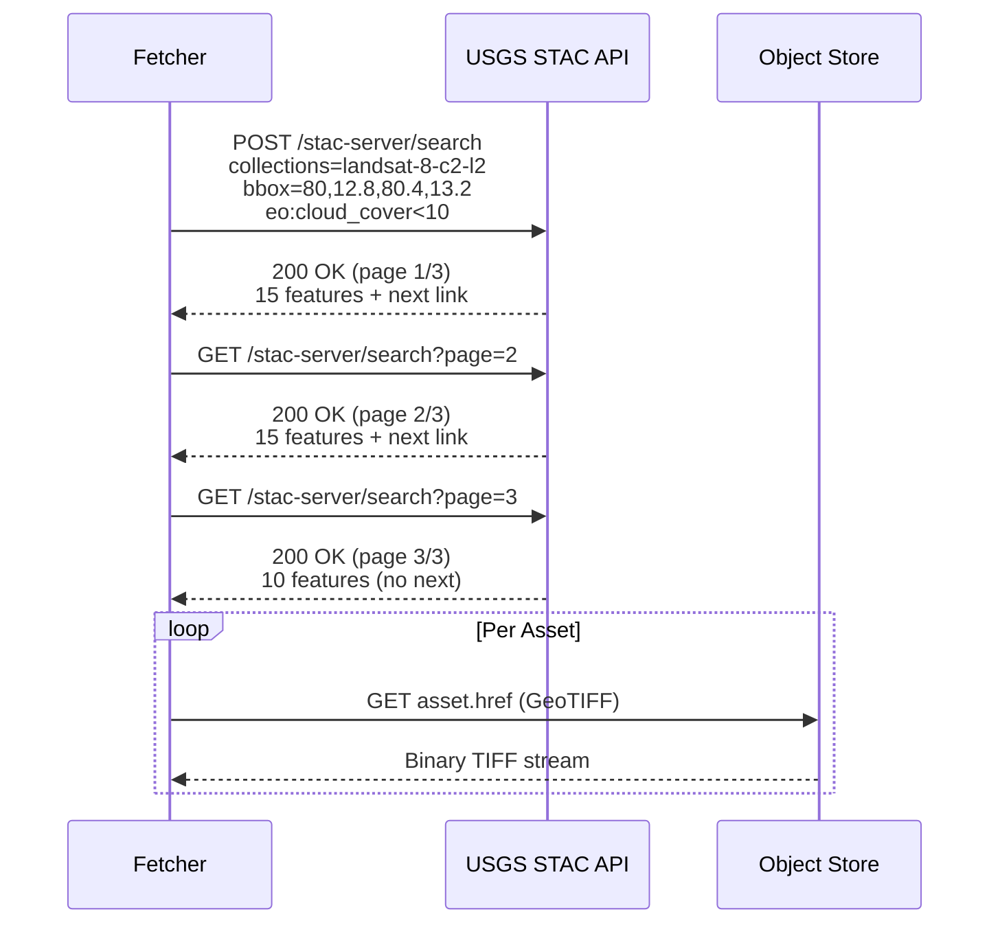

# Data Contracts

This document defines the schemas and contracts between pipeline stages. All inter-stage data is serialized as Apache Parquet.

## Stage 1 → Stage 2: Raw Parquet

**Directory:** `staging/raw/landsat/`

**Schema (`parser.Record`):**

| Column | Parquet Type | Logical Type | Description |
|--------|--------------|--------------|-------------|
| `tile_id` | BYTE_ARRAY | UTF8 | Landsat scene ID (e.g. `LC08_L2SP_144050_20240301`) |
| `lat` | DOUBLE | — | Pixel center latitude (WGS84) |
| `lon` | DOUBLE | — | Pixel center longitude (WGS84) |
| `band` | BYTE_ARRAY | UTF8 | Band name: `B2_Blue`, `B3_Green`, `B4_Red`, `B5_NIR`, `B6_SWIR1`, `B10_TIR` |
| `value` | DOUBLE | — | Pixel reflectance (optical) or brightness temperature (thermal) |
| `timestamp` | INT64 | TIMESTAMP_MILLIS | Acquisition time as epoch milliseconds |
| `lulc_class` | BYTE_ARRAY | UTF8 | Land-use/land-cover class label |

**Partitioning:** One file per scene ID under `staging/raw/landsat/{scene_id}.parquet`.

**Compression:** Snappy (default for parquet-go).

---

## Stage 2 → Stage 3: Dense Feature Matrix

> [!IMPORTANT]
> **Current contract (2026-08, dual-city).** Supersedes the single-city
> `matrix.parquet` schema below. The dense matrix is a *wide* per-pixel
> table partitioned by hive keys.

**Locations:**

| City | Path | Rows | Partitioning |
|------|------|------|--------------|
| Bangalore | repo-local `staging/dense/` | 21,480,252 | `year=YYYY/split={train,test}/` |
| Chennai v2 | `/mnt/f/helios-archive-recent/staging/dense_chennai_v2` | 25,848,772 | same |

**Schema (wide, one row per pixel per scene):**

| Column | Type | Description |
|--------|------|-------------|
| `tile_id` | UTF8 | Landsat scene ID |
| `lat`, `lon` | DOUBLE | Pixel center (WGS84) |
| `doy` | INT32 | Day of year of acquisition |
| `year`, `split` | INT64 / UTF8 | Hive partition keys (`split`: pipeline-written temporal label) |
| `lst` | DOUBLE | Split-window LST target (Kelvin) |
| `ndvi` | DOUBLE | Vegetation index |
| `lulc_class_encoded` | DOUBLE | Encoded LULC class |
| `zoning_category_encoded` | DOUBLE | Encoded zoning category |
| `B4_Red`, `B5_NIR`, `B6_SWIR1` | DOUBLE | Surface reflectance bands |
| `bt10`, `bt11`, `bt10_minus_bt11` | DOUBLE | Brightness temperatures (leakage-guarded) |
| `ST_B10` | DOUBLE | Single-channel thermal band (leakage-guarded) |
| `eps10`, `eps11`, `pv` | DOUBLE | Emissivities / vegetation fraction (excluded from features) |
| `ndbi` | DOUBLE | Built-up index (excluded from features) |
| `has_thermal_split` | BOOLEAN | Thermal availability flag |

**Compression:** ZSTD. **Size:** ~450 MB (Chennai v2, 43 scenes).

The legacy narrow schema (`band`/`value` long format, `lst_k`,
`timestamp`/`month`) applies only to pre-v2 archived matrices.

---

## ML Input Contract

The Python ensemble pipeline consumes the dense matrix with these expectations:

1. **Hive partitioning** — `year` and `split` resolve from directory names;
   `split` drives the `marker` split strategy (ADR-005). The `dynamic`
   strategy ignores it and derives the boundary from `year`+`doy`.
2. **Leakage guard** — thermal precursors (`ST_B10`, `bt10*`) are stripped
   before training (ADR-001).
3. **Feature exclusions** — `pv`, `eps10`, `eps11`, `ndbi`, plus non-feature
   columns, dropped in `ensemble.py` step 4.
4. **Seasonal features** — `doy_sin`/`doy_cos` added downstream from `doy`.
5. **float32 conversion** — performed once after column pruning; polars
   frames freed immediately (ADR-004).

---

## API Contracts (External)

### USGS LandsatLook STAC API


```mermaid
sequenceDiagram
    participant F as Fetcher
    participant STAC as USGS STAC API
    participant S3 as Object Store

    F->>STAC: POST /stac-server/search<br/>collections=landsat-8-c2-l2<br/>bbox=80,12.8,80.4,13.2<br/>eo:cloud_cover<10
    STAC-->>F: 200 OK (page 1/3)<br/>15 features + next link

    F->>STAC: GET /stac-server/search?page=2
    STAC-->>F: 200 OK (page 2/3)<br/>15 features + next link

    F->>STAC: GET /stac-server/search?page=3
    STAC-->>F: 200 OK (page 3/3)<br/>10 features (no next)

    loop Per Asset
        F->>S3: GET asset.href (GeoTIFF)
        S3-->>F: Binary TIFF stream
    end
```

**Base URL:** `https://landsatlook.usgs.gov/stac-server`

**Search endpoint:** `POST /stac-server/search`

**Request body (GeoJSON):**

```json
{
  "collections": ["landsat-8-c2-l2"],
  "datetime": "2014-01-01T00:00:00Z/2023-12-31T23:59:59Z",
  "bbox": [80.0, 12.8, 80.4, 13.2],
  "filter": {
    "op": "<",
    "args": [{"property": "eo:cloud_cover"}, 10]
  },
  "limit": 500
}
```

**Response:** STAC ItemCollection (GeoJSON FeatureCollection), each feature containing:
- `id`: Scene ID (e.g., `LC08_L2SP_144050_20240301`)
- `properties.datetime`: Acquisition timestamp
- `properties.eo:cloud_cover`: Cloud cover percentage
- `assets`: Dictionary of band assets with `href` (download URL)

**Rate limiting:** None documented, but polite clients should throttle to 5 requests/second.

### STAC Pagination

The STAC API uses link-based pagination. The response includes a `links` array; items with `"rel": "next"` point to the next page. The client follows these links until no `next` link is found.

### Asset Download

Each band asset has an `href` URL. The fetcher performs a standard HTTP GET with:
- `User-Agent: helios-ingestion/1.0`
- `Accept: image/tiff`
- Timeout: 2 minutes per asset
- Retries: 3 with exponential backoff (500ms base)
- Max response size: 512 MiB
