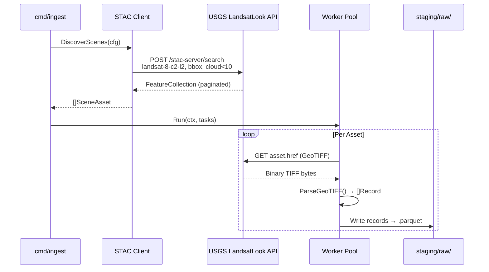
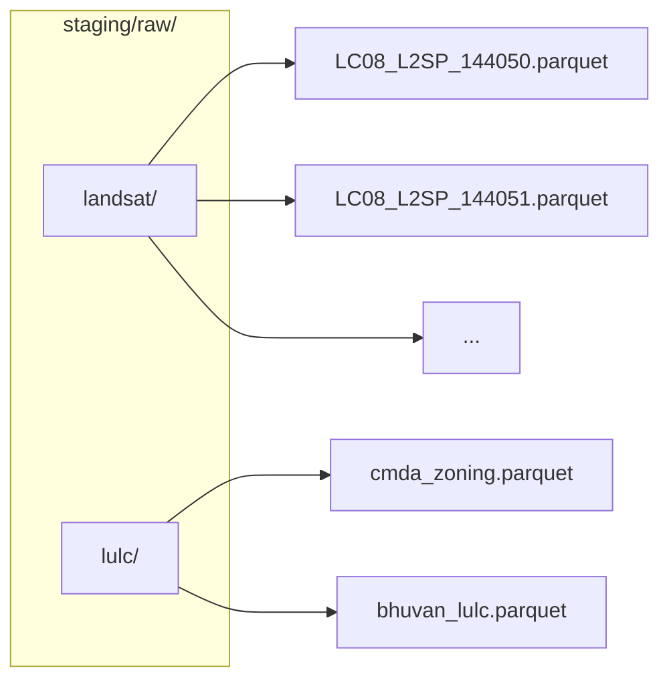

# Phase 1: Ingestion Layer (Go)

## Goal

Safely acquire and store 10 years of raw spatial data (2014--2023) without exhausting local storage or memory.

## Technology Choices

| Concern | Choice | Rationale |
|---------|--------|-----------|
| Language | Go 1.22+ | Excellent concurrency primitives, fast startup, small binary |
| HTTP | `net/http` with retries | Standard library, sufficient for REST API calls |
| Parquet | `xitongsys/parquet-go` | Pure Go, no CGO dependency, supports partitioned writes |
| API | USGS LandsatLook STAC | Open, no API key required for search |
| Concurrency | Goroutine worker pool | Bounded parallelism with context cancellation |

## Steps

### 1.1 Landsat Fetcher

Query the USGS LandsatLook STAC API to discover Landsat 8 Collection 2 Level 2 scenes for the Chennai AOI, filter by cloud cover < 10%, then download the thermal (Band 10) and optical (B2--B5, B6) assets.

**Boundary Box (Chennai):**

| Corner | Lat | Lon |
|--------|-----|-----|
| SW | 12.8 | 80.0 |
| NE | 13.2 | 80.4 |

**STAC Query Parameters:**

| Parameter | Value |
|-----------|-------|
| Collections | `landsat-8-c2-l2` |
| BBox | `80.0,12.8,80.4,13.2` |
| Datetime | `2014-01-01/2023-12-31` |
| Filter | `eo:cloud_cover < 10` |
| Limit | 500 |

**Asset Bands to Download:**

| Band | Name | Resolution | Purpose |
|------|------|-----------|---------|
| B2 | Blue | 30m | NDVI calculation |
| B3 | Green | 30m | NDVI calculation |
| B4 | Red | 30m | NDVI calculation |
| B5 | Near-Infrared | 30m | NDVI calculation |
| B6 | SWIR-1 | 30m | Cloud masking |
| B10 | Thermal Infrared | 100m (resampled to 30m) | LST calculation |

**Implementation:**

```
internal/fetcher/
├── stac.go        # Generic STAC API client (search, pagination)
├── landsat.go     # Landsat-specific scene discovery
└── fetcher.go     # HTTP download with retries (existing)
```



The STAC client:
1. Constructs a POST request to `/stac-server/search` with GeoJSON filter
2. Iterates paginated results using the `next` link
3. Returns a list of `Scene` structs with asset download URLs

A manifest is built from the discovered scenes, one `Task` per asset URL. The worker pool concurrently downloads and stages them.

### 1.2 Vector Parser

Parse CMDA Zoning Shapefiles and Bhuvan LULC datasets to extract polygon boundaries and feature types.

**Data Sources:**

| Source | Format | Content |
|--------|--------|---------|
| CMDA Zoning | Shapefile (SHP) | Administrative zones, land-use categories |
| Bhuvan LULC | GeoJSON | Land-use/land-cover classification (50m resolution) |

The parser:
1. Reads SHP/GeoJSON into memory using a pure-Go geometry library
2. Extracts polygon rings and attribute properties
3. Assigns a unique `lulc_class` label per feature
4. Outputs `Record` structs with lat/lon centroids and class labels

### 1.3 Raw Parquet Export

Convert records into partitioned Parquet files under `staging/raw/`.

**Partition Layout:**



**Parquet Schema (`Record`):**

| Column | Type | Description |
|--------|------|-------------|
| `tile_id` | UTF8 | Scene or feature ID |
| `lat` | DOUBLE | Latitude |
| `lon` | DOUBLE | Longitude |
| `band` | UTF8 | Band name (e.g. "B10_TIR") |
| `value` | DOUBLE | Pixel reflectance or temperature |
| `timestamp` | INT64 (MILLIS) | Acquisition epoch |
| `lulc_class` | UTF8 | Land-use classification |

## Running

```bash
# From project root:
make ingest

# Or directly:
cd ingestion-go && go run ./cmd/ingest \
    --output-dir ../staging/raw \
    --workers 8 \
    --stac-url https://landsatlook.usgs.gov/stac-server \
    --bbox 80.0,12.8,80.4,13.2 \
    --start-year 2014 \
    --end-year 2023 \
    --max-cloud 10
```

## Milestone

A local data lake of raw, partitioned Parquet files ready for heavy processing in Scala/Spark.
