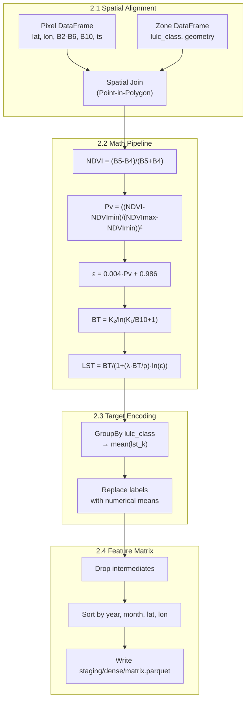

# Phase 2: Aggregation & Transformation Engine (Scala/Spark)

## Goal

Align the spatial grids, calculate LST, and produce a dense numerical feature matrix ready for ML training.

## Technology Choices

| Concern | Choice | Rationale |
|---------|--------|-----------|
| Language | Scala 2.13 | First-class Spark support, functional style for transforms |
| Engine | Spark 3.5 | Distributed spatial joins, in-memory columnar processing |
| Build | SBT 1.10 | Standard Scala build tool |
| Geometry | `org.locationtech.geotools` or `org.apache.sedona` | Spatial join operations |

## Steps

### 2.1 Spatial Alignment

**Input:** Raw Parquet files from `staging/raw/`

**Operation:**
1. Load Landsat band records into a Spark DataFrame
2. Pivot band/value pairs so each pixel becomes a wide row with columns: `B2`, `B3`, `B4`, `B5`, `B6`, `B10`
3. Load LULC polygon records into a separate DataFrame
4. Convert pixel lat/lon to Point geometry and polygon rings to Polygon geometry
5. Perform a spatial join: assign each pixel its containing zone's `lulc_class`

**Output:** Wide DataFrame with pixel coordinates, all bands, and a `lulc_class` string column.

### 2.2 Math Pipeline

Compute LST from Landsat thermal band data using the standard split-window algorithm.

**Formulas:**

| Step | Formula | Description |
|------|---------|-------------|
| NDVI | `(B5 - B4) / (B5 + B4)` | Normalized Difference Vegetation Index |
| Pv | `((NDVI - NDVI_min) / (NDVI_max - NDVI_min))^2` | Vegetation proportion |
| Emissivity (ε) | `0.004 * Pv + 0.986` | Surface emissivity |
| BT | `K2 / ln(K1 / B10 + 1)` | Brightness temperature (Kelvin) using Landsat thermal constants |
| LST | `BT / (1 + (λ * BT / ρ) * ln(ε))` | Land Surface Temperature in Kelvin |

**Constants (Landsat 8 Band 10):**
- `K1 = 774.8853` (W/(m²·sr·µm))
- `K2 = 1321.0789` (K)
- `λ = 10.895` (µm, center wavelength)
- `ρ = 1.438e-2` (m·K, `h * c / σ`)

**Output:** DataFrame with `lat`, `lon`, `timestamp`, `lst_k` (LST in Kelvin), `ndvi`, `lulc_class`.

### 2.3 Target Encoding

Address the high-cardinality zoning data by replacing string labels with historical mean LST values.

**Procedure:**
1. Group by `lulc_class` and compute `mean(lst_k)` over all historical data
2. Create a mapping: `lulc_class → mean_lst`
3. Replace the string column with the numerical mean vector
4. Add a `count` column indicating sample size per class (useful for confidence weighting downstream)

**Why target encoding instead of one-hot?**
- Zoning has 50+ categories; one-hot would explode feature dimensionality
- Target encoding preserves ordinal relationships (e.g., industrial zones have higher mean LST than parks)

### 2.4 Feature Matrix Generation



**Operations:**
1. Drop intermediate columns (`B2`--`B6`, `B10`, `BT`, `ndvi_raw`, etc.)
2. Keep only: `lat`, `lon`, `timestamp`, `lst_k`, `ndvi`, `lulc_encoded`, `lulc_count`, `month`, `year`
3. Round floating-point values to 4 decimal places to reduce file size
4. Repartition to a single partition and sort by `(year, month, lat, lon)`
5. Write as compressed Parquet to `staging/dense/matrix.parquet`

**Output Schema:**

| Column | Type | Description |
|--------|------|-------------|
| `lat` | DOUBLE | Latitude (rounded to 4dp) |
| `lon` | DOUBLE | Longitude (rounded to 4dp) |
| `timestamp` | INT64 | Acquisition epoch millis |
| `year` | INT | 2014--2023 |
| `month` | INT | 1--12 |
| `lst_k` | DOUBLE | LST in Kelvin |
| `ndvi` | DOUBLE | Normalized Difference Vegetation Index |
| `lulc_encoded` | DOUBLE | Target-encoded LULC mean LST |
| `lulc_count` | INT | Samples in encoding group |

## Running

```bash
make process
```

## Milestone

A clean, numerical feature matrix (~500 MB for 10 years of Chennai data) that Python can load in seconds without exhausting RAM.
