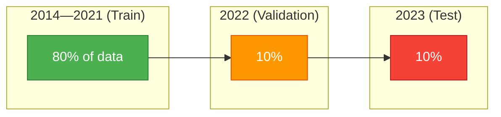

# Phase 3: Machine Learning Pipeline (Python)

## Goal

Train an XGBoost model to predict Land Surface Temperature from zoning, NDVI, and temporal features, then validate predictive accuracy on unseen years.

## Technology Choices

| Concern | Choice | Rationale |
|---------|--------|-----------|
| Language | Python 3.12+ | Rich ML ecosystem, rapid iteration |
| Data loading | Polars | 10--100x faster than pandas for columnar Parquet |
| Model | XGBoost | Gradient boosting, handles non-linear relationships, feature importance |
| Environment | `uv` | Fast dependency resolver, lockfile-based reproducibility |
| Linting | Ruff | 100x faster than Flake8, same rules |

## Steps

### 3.1 Data Loading

Load the dense Parquet matrix using Polars:

```python
import polars as pl

df = pl.read_parquet("staging/dense/matrix.parquet")
print(df.shape)  # (~2 million rows, 9 columns)
```

Polars lazy API (`pl.scan_parquet`) can be used for memory-efficient processing if the full dataset does not fit in RAM.

### 3.2 Temporal Split

**Do NOT use random train/test splits** — climate data has strong temporal autocorrelation. Random splits would leak future information into the training set and produce artificially high accuracy.



**Split strategy:**

| Set | Years | Rows (approx) |
|-----|-------|-------------|
| Train | 2014--2021 | 80% |
| Validation | 2022 | 10% |
| Test | 2023 | 10% |

```python
train = df.filter(pl.col("year") <= 2021)
val   = df.filter(pl.col("year") == 2022)
test  = df.filter(pl.col("year") == 2023)
```

### 3.3 Model Training

**Feature matrix (X):** `["lulc_encoded", "lulc_count", "ndvi", "month", "lat", "lon"]`

**Target (y):** `"lst_k"`

**Model configuration:**

```python
import xgboost as xgb

model = xgb.XGBRegressor(
    n_estimators=1000,
    learning_rate=0.05,
    max_depth=6,
    subsample=0.8,
    colsample_bytree=0.8,
    early_stopping_rounds=50,
    eval_metric="rmse",
    random_state=42,
)

model.fit(
    X_train, y_train,
    eval_set=[(X_val, y_val)],
    verbose=100,
)
```

**Hyperparameter rationale:**

| Parameter | Value | Reason |
|-----------|-------|--------|
| `n_estimators` | 1000 | Enough for convergence with early stopping |
| `learning_rate` | 0.05 | Prevents overfitting, allows deeper trees |
| `max_depth` | 6 | Captures spatial interactions without over-specializing |
| `subsample` | 0.8 | Row sampling for robustness |
| `colsample_bytree` | 0.8 | Column sampling to reduce overfitting |

### 3.4 Feature Importance & Evaluation

**Metrics on test set:**

- **RMSE** (Root Mean Square Error) — primary metric, in Kelvin
- **MAE** (Mean Absolute Error)
- **R²** (Coefficient of determination)
- **MAPE** (Mean Absolute Percentage Error)

**Target performance:** RMSE < 2.0 K on 2023 test set.

**Feature importance:**

Extract and plot SHAP values or XGBoost's built-in `feature_importances_`:

```python
importances = model.feature_importances_
for name, imp in zip(feature_names, importances):
    print(f"{name}: {imp:.4f}")
```

Expected finding: `lulc_encoded` and `ndvi` are the top two predictors, demonstrating that local zoning data is critical for urban heat island prediction.

## Running

```bash
make train
```

## Milestone

A validated XGBoost model with RMSE < 2.0 K on held-out years, plus quantitative proof that land-use zoning is a significant predictor of LST.
