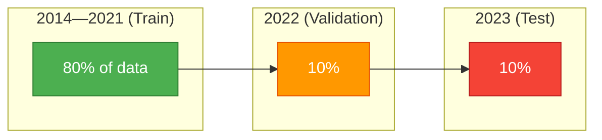

# Phase 3: Machine Learning Pipeline (Python)

## Goal

Train an XGBoost model to predict Land Surface Temperature from zoning, NDVI, and temporal features, then validate predictive accuracy on unseen years.

## Technology Choices

| Concern | Choice | Rationale |
|---------|--------|-----------|
| Language | Python 3.12+ | Rich ML ecosystem, rapid iteration |
| Data loading | Polars | 10--100x faster than pandas for columnar Parquet |
| Model | XGBoost | Gradient boosting, handles non-linear relationships, feature importance |
| Environment | `uv` | Fast dependency resolver, lockfile-based reproducibility |
| Linting | Ruff | 100x faster than Flake8, same rules |

## Steps

### 3.1 Data Loading

Load the dense Parquet matrix using Polars:

```python
import polars as pl

df = pl.read_parquet("staging/dense/matrix.parquet")
print(df.shape)  # (~2 million rows, 9 columns)
```

Polars lazy API (`pl.scan_parquet`) can be used for memory-efficient processing if the full dataset does not fit in RAM.

### 3.2 Temporal Split

**Do NOT use random train/test splits** — climate data has strong temporal autocorrelation. Random splits would leak future information into the training set and produce artificially high accuracy.


```mermaid
flowchart LR
    subgraph "2014—2021 (Train)"
        Y1["80% of data"]
    end
    subgraph "2022 (Validation)"
        Y2["10%"]
    end
    subgraph "2023 (Test)"
        Y3["10%"]
    end
    Y1 --> Y2 --> Y3
    style Y1 fill:#4caf50,stroke:#2e7d32,color:#fff
    style Y2 fill:#ff9800,stroke:#e65100,color:#fff
    style Y3 fill:#f44336,stroke:#b71c1c,color:#fff
```

**Split strategy:**

> [!WARNING]
> **Superseded.** The static year-range split below reflects the original
> design only. Current policy is per-city (ADR-005): Bangalore uses the
> dynamic rolling 12-month window (`strategy="dynamic"`); Chennai uses the
> fixed calendar-year marker window (`strategy="marker"`), matching its
> single-model evaluation. See `docs/adrs/005-temporal-split-policy.md`.

| Set | Years | Rows (approx) |
|-----|-------|-------------|
| Train | 2014--2021 | 80% |
| Validation | 2022 | 10% |
| Test | 2023 | 10% |

```python
train = df.filter(pl.col("year") <= 2021)
val   = df.filter(pl.col("year") == 2022)
test  = df.filter(pl.col("year") == 2023)
```

### 3.3 Model Training

**Feature matrix (X):** `["lulc_encoded", "lulc_count", "ndvi", "month", "lat", "lon"]`

> [!IMPORTANT]
> **Data Leakage Guard**
> The target variable (LST) is derived directly from thermal bands. You **MUST NOT** include `ST_B10`, `bt10`, `bt11`, or `bt10_minus_bt11` in the feature matrix, otherwise the model will achieve an artificial R² of 1.0. A hardcoded leakage guard in `train.py` actively strips these out. See ADR-001.

**Target (y):** `"lst_k"`

**Model configuration:**

```python
import xgboost as xgb

model = xgb.XGBRegressor(
    n_estimators=1000,
    learning_rate=0.05,
    max_depth=6,
    subsample=0.8,
    colsample_bytree=0.8,
    early_stopping_rounds=50,
    eval_metric="rmse",
    random_state=42,
)

model.fit(
    X_train, y_train,
    eval_set=[(X_val, y_val)],
    verbose=100,
)
```

**Hyperparameter rationale:**

| Parameter | Value | Reason |
|-----------|-------|--------|
| `n_estimators` | 1000 | Enough for convergence with early stopping |
| `learning_rate` | 0.05 | Prevents overfitting, allows deeper trees |
| `max_depth` | 6 | Captures spatial interactions without over-specializing |
| `subsample` | 0.8 | Row sampling for robustness |
| `colsample_bytree` | 0.8 | Column sampling to reduce overfitting |

### 3.4 Feature Importance & Evaluation

**Metrics on test set:**

- **RMSE** (Root Mean Square Error) — primary metric, in Kelvin
- **MAE** (Mean Absolute Error)
- **R²** (Coefficient of determination)
- **MAPE** (Mean Absolute Percentage Error)

**Target performance:** RMSE < 2.0 K on 2023 test set.

**Feature importance:**

Extract and plot SHAP values or XGBoost's built-in `feature_importances_`:

```python
importances = model.feature_importances_
for name, imp in zip(feature_names, importances):
    print(f"{name}: {imp:.4f}")
```

> [!NOTE]
> **SHAP Silent Failures**
> Generating SHAP plots on a 25M-row matrix can occasionally cause the `TreeExplainer` C-extensions to crash (OOM). If SHAP plots are missing from the output directory, check `shap_error_traceback.log` for the silent failure stack trace. See ADR-003.

Expected finding: `lulc_encoded` and `ndvi` are the top two predictors, demonstrating that local zoning data is critical for urban heat island prediction.

## Running

```bash
make train
```

## Milestone

A validated XGBoost model with RMSE < 2.0 K on held-out years, plus quantitative proof that land-use zoning is a significant predictor of LST.

---

## 3.5 Multi-Model Ensemble (current methodology, 2026-08)

The single-model stage above is superseded by a 4-model ensemble pipeline
(`helios_ml/ensemble.py`), run **identically for both cities** at full
resolution: XGBoost, LightGBM, CatBoost, HistGradientBoosting ("GradientBoost"),
each in Base (defaults) and Tuned configurations, plus equal-weight mean
ensembles of the four.

### Methodology invariants

| Concern | Policy |
|---------|--------|
| Sampling | None — full resolution (21.5M / 25.8M rows) |
| Split | Per-city policy, ADR-005 (`--split-strategy`) |
| Leakage guard | Thermal precursors + null/excluded cols stripped (ADR-001) |
| Memory strategy | float32 arrays, `used_ram_limit='4gb'`, serialize-after-fit, chunked predict (ADR-004) |
| SHAP | Random sample n=10,000 test rows, fixed seed; `shap_sample_rows` recorded per model |
| Ensembling | Equal-weight mean of per-model test-prediction vectors |

### Results (full resolution, 2026-08-21)

**Bangalore** — dynamic window, cutoff 2024-12-10 (train 18.2M / test 3.27M, 4 scenes):

| Configuration | MAE (K) | RMSE (K) | R² |
|---|---|---|---|
| Best individual — GradientBoost (Tuned) | 2.009 | 2.377 | 0.362 |
| Base Ensemble | 1.732 | 2.077 | 0.513 |
| **Tuned Ensemble** | **1.696** | **2.041** | **0.529** |

**Chennai** — fixed calendar-year window 2025–2026 (train 19.3M / test 6.54M, 11 scenes):

| Configuration | MAE (K) | RMSE (K) | R² |
|---|---|---|---|
| Single-model headline (pre-ensemble) | — | — | 0.7999 |
| Best individual — CatBoost (Tuned) | 1.895 | 2.438 | 0.810 |
| **Base Ensemble** | **1.972** | **2.565** | **0.790** |
| Tuned Ensemble | 2.105 | 2.733 | 0.761 |

> [!NOTE]
> The single-model headline (R²=0.7999) and the ensemble table above are now
> evaluated on the same fixed calendar-year window, so they are directly
> comparable. The earlier rolling-window Chennai ensembles (base R²=0.734 /
> tuned R²=0.707) were evaluated on a *different* test set and are retained
> only under `ml-ensemble-fullres-v2-chennai/` for provenance.

### Artifact map

```
/mnt/f/helios-archive/reports/
├── ml-ensemble-fullres-v2-bangalore/        # FINAL (dynamic split)
│   ├── ensemble_metrics.json                # incl. shap_sample_rows, members
│   ├── models/*.joblib                      # all 8 serialized models
│   ├── shap_*.png                           # bounded-sample SHAP plots
│   └── split_evidence.txt                   # cutoff, scene list, LST stats
├── ml-ensemble-fullres-v3-chennai-fixedwindow/  # FINAL (marker split)
│   ├── (same layout)
│   ├── split_evidence.txt
│   └── table_B1_chennai_scenes.{md,csv}     # 43-scene inventory w/ AOI cloud %
├── ml-ensemble-fullres-v2-chennai/          # superseded (rolling window)
└── ml-ensemble-fullres-OLDSPLIT-do-not-use/ # quarantined (stale markers)
```

## Limitations & Future Work

### Water vapor placeholder in split-window LST

The split-window LST retrieval (implemented in `processing-scala/src/main/scala/helios/LSTMath.scala`) currently uses a **constant placeholder value of 2.0 g/cm²** for atmospheric water vapor content (`waterVapor` in `Config.scala`). This is a known source of systematic error because:

- Real atmospheric water vapor varies spatially and temporally (typical range 0.5–6 g/cm²)
- The split-window coefficients (`sw-a0` through `sw-a6`) were derived assuming a water vapor profile; a constant value introduces scene-dependent bias
- This error is independent of the single-channel vs. split-window model limitation and the zoning predictor gap

**Resolution:** Integrate a real per-scene water vapor product (MODIS MOD07, NCEP/NCAR reanalysis, or ERA5) into the Scala aggregation pipeline. The config parameter `water-vapor` is already exposed via CLI (`--water-vapor`) to accept dynamic values once a data source is wired in. **Data source available** on F drive (`/mnt/f/helios-archive/`) via local hard disk for download/preprocessing.

### Single-channel thermal baseline

The single-channel LST (`ST_B10`) is retained in the feature matrix but excluded from model features by the leakage guard (ADR-001). It serves as a baseline for comparison but does not benefit from atmospheric correction. Future work should evaluate whether a corrected single-channel method (e.g., Jimenez-Munoz et al. 2009) can close the gap with split-window when water vapor is properly accounted for.

### Cross-city generalisation

Bangalore (dynamic 12-month window, 4 test scenes) and Chennai (fixed calendar window, 11 test scenes) use different temporal split strategies per ADR-005. Direct quantitative comparison of R² across cities is not valid; any cross-city claim must be qualitative.
